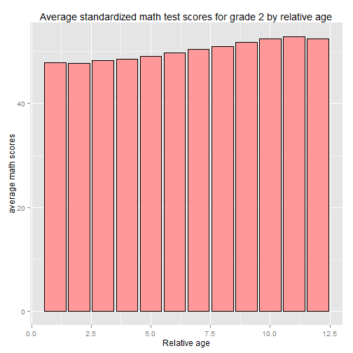
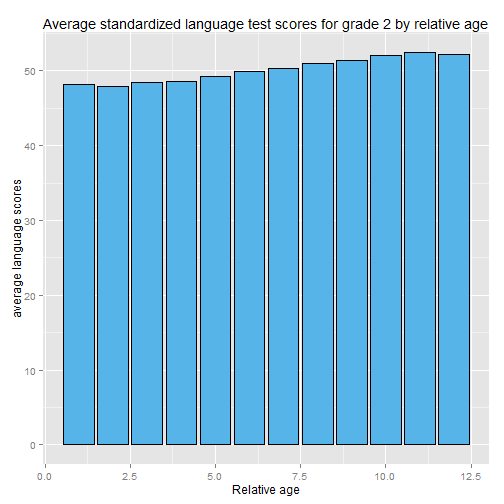
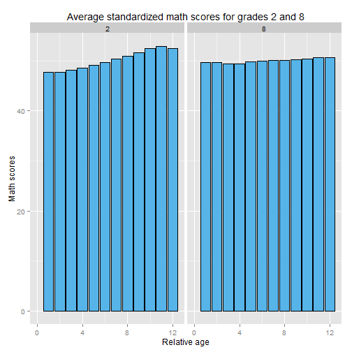
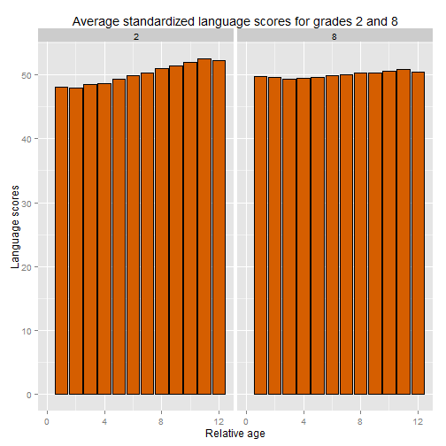

## 1. What is the relative age effect?
This is a brief summary of the visual analysis of the raw data I used for an academic paper. My idea was to see how the relative age gap is progressing over primary education in the Dutch educational system. Miinimum age schooling laws determine school eligibility based on the birth date of a student. Therefore, students born a few days before the cut-off can enroll in the year in which they turn eligible. However, their peers born only a few days later, and after the cut-off have to wait an additional year to enroll. 

Thus, in nearly all educational systems we have students almost an year older than their peers. There is a large literature investigating how the relatively youngest students perform in comparison to the relatively oldest.

Relatively older pupils are shown to perform better on test scores than the younger ones, they have lower probability to repeat a grade, to be diagnosed with a learning disorder, to go to college, and even can have worse outcomes at the labor market.

The big question is, however, what are the mechanisms driving this link? And if there is a gap between the oldest and the youngest, how long does it persist, does it reduce over time (or is it amplified), and how does the education system affect it?

In my paper I used data from Dutch primary education, where we have pupils in grades 2, 4, 6, and 8. In the graphs below, I show the test scores in math and language tests for students in grades 2 and 8 by relative age. We see that by grade 8 the difference is much smaller. Though not visibile entirely on the graph, this gap is still statistically significant. 

First, I am doing some aggregation over wave of the data set (as I have six waves of data) and the class (so-called groep variable)

```r
#setwd("C:/Users/user/Dropbox/coursera/Relative-age-graphs")
#df<-read.csv("All_waves.csv")
#aggregating the variables by means of test scores for prima and groep
#df2<-aggregate(df[c("ztheta", "zthe_taal", "zcito")],             
#by=list(relage=df$relage,groep=df$groep), mean, na.rm=TRUE, 
# na.action=NULL)

#aggregating only those for grade 2

#dfgr2<-aggregate(df[c("ztheta", "zthe_taal", "zcito")],             
               #by=list(relage=df$relage,groep=df$groep==2), mean, na.rm=TRUE, 
               #na.action=NULL)
#new<-dfgr2[13:24,]
```


```r
#graphing mean math scores for grade 2
setwd("C:/Users/user/Dropbox/coursera/Relative-age-graphs")
load("new.Rda")
load("new2.Rda")
library(ggplot2)
ggplot(new, aes(new$relage, new$ztheta))+
    geom_bar(stat="identity", fill="#FF9999", colour="black")+
    xlab("Relative age")+ylab("average math scores")+ 
ggtitle("Average standardized math test scores for grade 2 by relative age")
```

 

```r
ggplot(new, aes(new$relage, new$zthe_taal))+
    geom_bar(stat="identity", color="black", fill="#56B4E9")+
    xlab("Relative age")+ylab("average language scores")+ 
ggtitle("Average standardized language test scores for grade 2 by relative age")
```

 


```r
#aggregating for grade 8
#dfgr8<-aggregate(df[c("ztheta", "zthe_taal", "zcito")],             
#                by=list(relage=df$relage,groep=df$groep==8), mean, na.rm=TRUE, 
#                                   na.action=NULL)

#new2<-dfgr8[13:24,]
combined<-rbind(new, new2)
combined$groep<-ifelse(combined$zcito=="NaN", 2, 8)
```


```r
#after groups 2 and 8 have been combined, make a graph where we have them both
ggplot(combined, aes(combined$relage, combined$ztheta))+
    geom_bar(stat="identity", color="black", fill="#56B4E9")+facet_grid(.~groep)+
    xlab("Relative age")+ylab("Math scores")+expand_limits(x=0, y=0)+
    ggtitle("Average standardized math scores for grades 2 and 8")
```

 

```r
ggplot(combined, aes(combined$relage, combined$zthe_taal))+
    geom_bar(stat="identity", color="black", fill="#D55E00")+facet_grid(.~groep)+
    xlab("Relative age")+ylab("Language scores")+expand_limits(x=0, y=0)+
    ggtitle("Average standardized language scores for grades 2 and 8")
```

 

